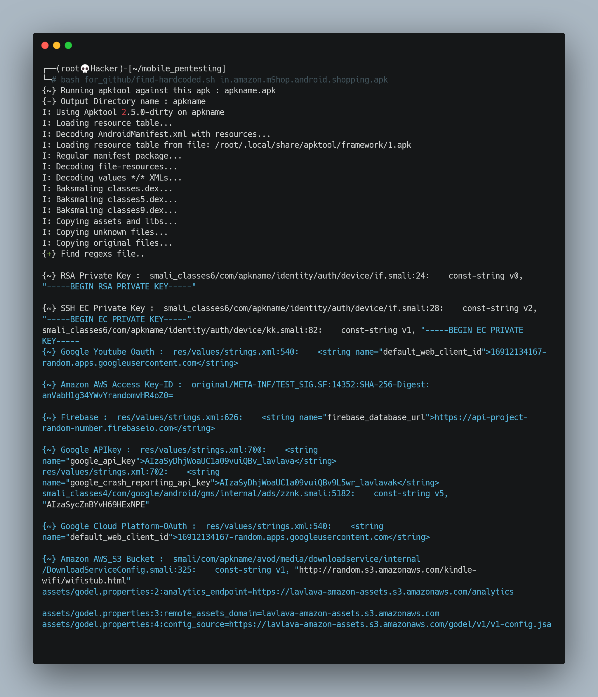

<h1 align="center">
  </a>
  <br>

</h1>


# Find-Hardcoded
You can find hardcoded Api-Key,Secret,Token Etc..


## Usage
```
┌──(root💀Hacker)-[~/mobile_pentesting]
└─# bash find-hardcoded.sh InsecureShop.apk
```

<h1 align="left">
  </a>
  <br>
</h1>


##### Prerequisites
- apktool {apt install apktool} @iBotPeaches(https://github.com/iBotPeaches/Apktool)


#### regex credit
```
https://github.com/dwisiswant0/apkleaks/blob/master/config/regexes.json
https://github.com/stevemcilwain/quiver/blob/master/payloads/secrets-content.json
https://github.com/hahwul/dalfox/blob/main/pkg/scanning/grep.go
https://github.com/BitTheByte/Eagle/blob/master/plugins/spider.py
https://github.com/firmianay/Vehicle-Security-Toolkit/blob/main/apk-leaks.py
https://github.com/dwisiswant0/apkleaks/blob/master/config/regexes.json
https://github.com/stevemcilwain/quiver/blob/master/payloads/secrets-content.json
```
